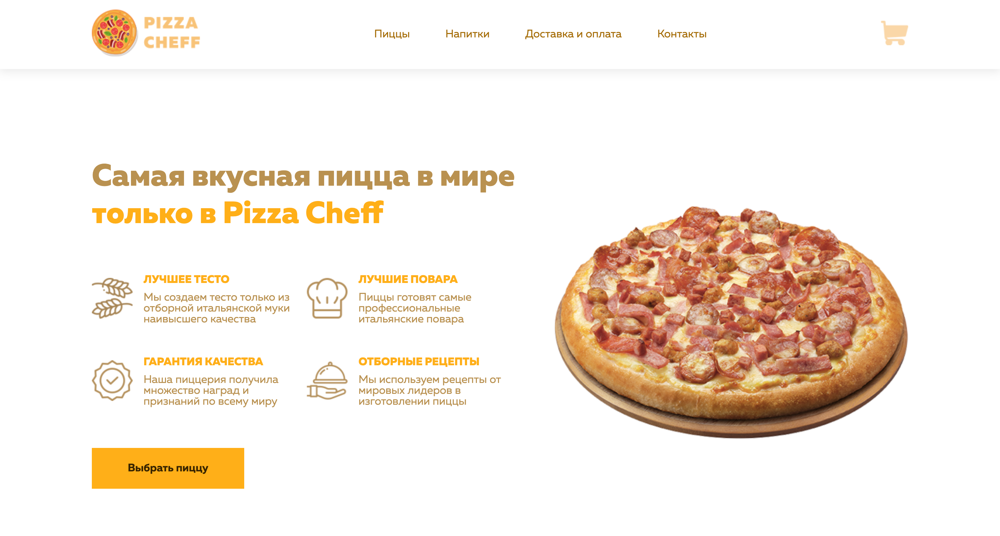

# Pizza Cheff - Лендинг

**Pizza Cheff** - это великолепный лендинг для заказа самой вкусной пиццы в мире. Сайт полностью адаптирован для различных устройств, чтобы ваши клиенты могли наслаждаться великолепной пиццей где угодно и когда угодно.

  
*Скриншот главной страницы*

## Технологии

- HTML
- CSS
  - Адаптивный дизайн
- JS (если присутствует, хотя в предоставленной структуре проекта это не указано)

## Структура проекта

```
PIZZACHEFF/
│
├── fonts/              # Шрифты, используемые на сайте
│
├── images/             # Изображения, используемые на сайте
│
└── styles/             # Стили проекта
   ├── adaptive.css     # Стили для адаптивного дизайна
   └── styles.css       # Основные стили сайта
│
└── index.html          # Главная страница сайта
```

## Инструкции

1. Откройте файл `index.html` в вашем браузере для просмотра сайта.
2. Чтобы просмотреть адаптивность сайта, попробуйте изменить размер окна вашего браузера или откройте сайт на мобильном устройстве.
3. Наслаждайтесь вкусной пиццей!

---

Спасибо за интерес к нашему проекту! Если у вас возникнут вопросы, пожалуйста, обращайтесь по адресу: support@macaroons.com.
